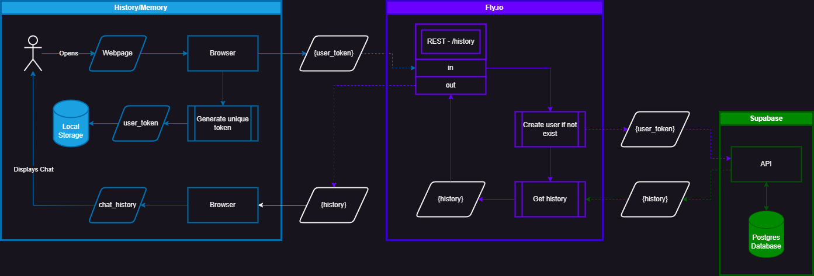
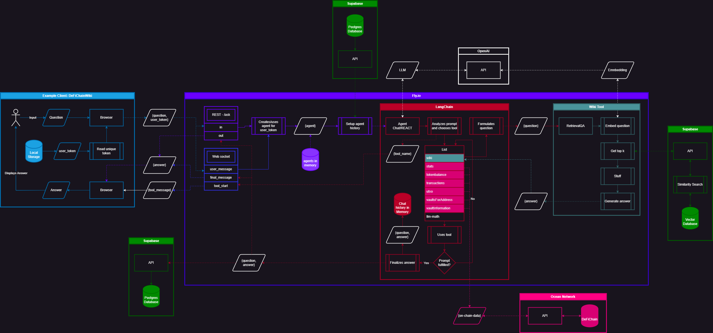

# JellyChat

> https://defichainwiki.com/jellychat

JellyChat is a project that aims to create a chatbot that can answer questions about DeFiChain and its ecosystem.

❗ There are many people which want to learn more about DeFiChain and its ecosystem. However, it is not always easy to find the right information. Also, many people struggle to take in information from various articles in a wiki.

✨ JellyChat aims to solve this by providing the ability for users to interactively ask questions and have an ongoing conversation.

## Main Objectives

- Make learning about DeFiChain fun.
- Be able to answer general questions about DeFiChain and its ecosystem.
- Be able to answer questions involving on-chain data.
- Behave like Jelly (the DeFiChain mascot).
- Feel like a friend that you can ask anything.

## Architecture

This gives a **high-level** overview of the architecture. For more details, please refer to the individual components.

[📂 Download diagram source](./docs/process.drawio)

### Accounts and History

Identification of accounts is done with a `user_token` which the client needs to store. The client then posts this `user_token` to `/history` and gets the history back if the account exists. If the account does not exist, a new one is created automatically.

### Input/Output Flow

The client posts a user message and a `user_token` to `/user_message`. A LangChain agent will be created for the specific `user_token` and the memory is filled from the history. The agent will then analyze the user's message and return an answer. The answer is then returned to the client and also added to the history.

## Key Components

The Repository contains the following key components.

### 🌐 `/backend`

The backend is a Flask API that receives questions and returns answers. It uses a LangChain agent to analyze the question and then uses various tools to best answer the question.

[Details 🔎](./backend/Readme.md)

### 💽 `/data`

We use Supabase to store:

- Users
- Messages
- QA data
- Embeddings

[Details 🔎](./data/Readme.md)

### ⚡️ `/job`

Contains scripts that are executed periodically. Currently, it contains a script that scrapes defichainwiki.com and creates embeddings for each document. The embeddings are saved to Supabase (pgvector).

[Details 🔎](./job/Readme.md)

## Workflow and Environments

The `main` branch resembles the production code. When a feature is ready, a pull request is created onto `main`. This will trigger the staging actions so the changes can be tested on the staging environment.

- [💽 Staging Database](https://supabase.com/dashboard/project/iajfqvpslzrtmvekqwpv)
  - Endpoint: https://iajfqvpslzrtmvekqwpv.supabase.co
- [🌐 Staging Backend](https://fly.io/apps/jellychat-staging)
  - Endpoint: https://jellychat-staging.fly.dev

When the pull request is merged (changes are pushed to `main`), the production action will be triggered and the changes will be deployed to production.

- [💽 Production Database](https://supabase.com/dashboard/project/cofmxsabxteiidryklyg)
  - Endpoint: https://cofmxsabxteiidryklyg.supabase.co
- [🌐 Production Backend](https://fly.io/apps/jellychat)
  - Endpoint: https://jellychat.fly.dev
